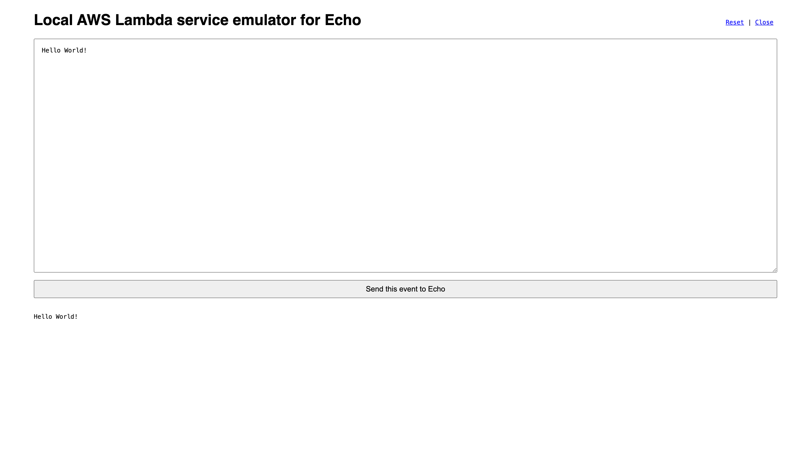
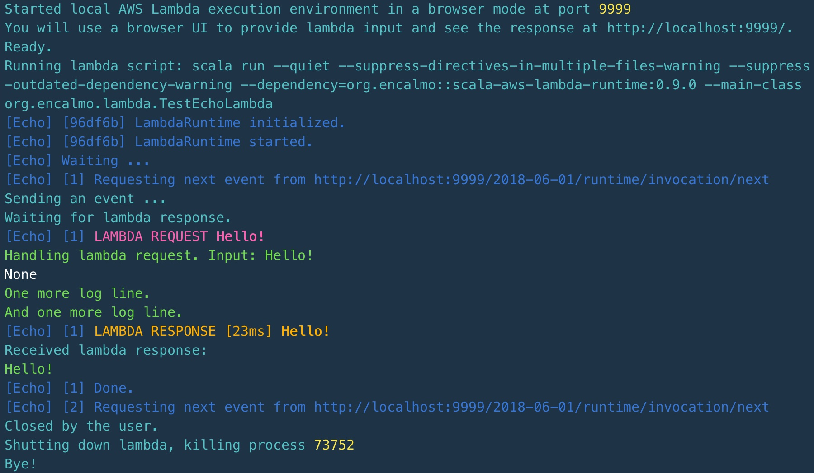

# scala-aws-lambda-local-host

Local emulator of the AWS Lambda host environment.

Starts local HTTP server implementing https://docs.aws.amazon.com/lambda/latest/dg/runtimes-api.html.

Provides browser-based HTML interface to send input to lambda and to read output.




## Usage

Use with SBT

    libraryDependencies += "org.encalmo" %% "scala-aws-lambda-local-host" % "0.9.1"

or with SCALA-CLI

    //> using dep org.encalmo::scala-aws-lambda-local-host:0.9.1

## Options

|Option|Description|
|---|---|
|--mode|User interface choice. Either `commandline` (default) or `browser`|
|--lambda-name|Name of the lambda passed to AWS_LAMBDA_FUNCTION_NAME environment variable|
|--lambda-script|Command line to run custom lambda runtime|

## Example

Run AWS Lambda host locally (works with any lambda runtime):

```
scala run --main-class org.encalmo.lambda.host.LocalLambdaHost \
    --quiet --suppress-directives-in-multiple-files-warning \
    --suppress-outdated-dependency-warning . \
    -- \
    --mode=browser
```

Run AWS Lambda host locally with some Scala lambda:

```
scala run --main-class org.encalmo.lambda.host.LocalLambdaHost \
    --quiet --suppress-directives-in-multiple-files-warning \
    --suppress-outdated-dependency-warning . \
    -- \
    --mode=browser \
    --lambda-script="scala run --quiet --suppress-directives-in-multiple-files-warning --suppress-outdated-dependency-warning --dependency=org.encalmo::scala-aws-lambda-runtime:0.9.1 --main-class org.encalmo.lambda.TestEchoLambda" \
    --lambda-name=Echo
```

Run an example TestEchoLambda:

```
/scripts/runTestEchoLambdaHostInBrowser.sh
```
